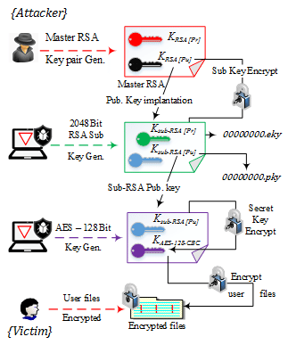

<center>
    
</center>

# Stockholm
This program is a part of 42 cybersecurity piscine. that work for malware creation. The `Stockholm` program is wannacry cloned progame that work same as this thing

# Table of contents
<!--ts-->
- [Stockholm](#stockholm)
- [Table of contents](#table-of-contents)
  - [What is wannacry](#what-is-wannacry)
  - [How wannacry works](#how-wannacry-works)
- [Install](#install)
  - [Prerequisite](#prerequisite)
  - [Start](#start)
- [Usage](#usage)
  - [CLI option](#cli-option)
- [Sources](#sources)
<!--te-->

## What is wannacry
WannaCry is an example of crypto ransomware, a type of malicious software (malware) used by cybercriminals to extort money.

Ransomware does this by either encrypting valuable files, so you are unable to read them, or by locking you out of your computer, so you are not able to use it.

Ransomware that uses encryption is called crypto ransomware. The type that locks you out of your computer is called locker ransomware.

Like other types of crypto-ransomware, WannaCry takes your data hostage, promising to return it if you pay a ransom.

WannaCry targets computers using Microsoft Windows as an operating system. It encrypts data and demands payment of a ransom in the cryptocurrency Bitcoin for its return.

## How wannacry works

The wannacry use hybrid key solution to encrypt a file with RSA and AES .



# Install
## Prerequisite
1. change file `app/.env.example` to `app/.env`
2. update key location in environment file
      ```txt
      STOCKHOLM_SYMMETRIC_KEY=
      STOCKHOLM_HYBRID_KEY=
      STOCKHOLM_PUBLIC_KEY=
      STOCKHOLM_PRIVATE_KEY=
      ```
## Start
1. start a container
    ```bash
    make
    ```
2. exec in to container
    ```bash
    make exec
    ```

# Usage
To encryption all file
```bash
./stockholm
```
To reverese encrypted file to normal
```bash
./stockholm -r
```
## CLI option
* `-v`, `--version` to check program version
* `-s`, `--silent` to mute program loggin output
* `-p`, `--path to` specify path to encrypt files


# Sources
- [wannacry analysis]
- [cryptography library]
- [cryptography with RSA]
  
<!-- Link -->
[wannacry analysis]: https://www.secureworks.com/research/wcry-ransomware-analysis
[cryptography library]: https://cryptography.io/
[cryptography with RSA]: https://medium.com/@madeenali2003/unlocking-cryptography-a-hands-on-guide-to-encrypting-and-decrypting-files-using-python-611766e73f7a
[Approch]: https://colab.research.google.com/drive/1KMPGTb02FGlOMmP7OzDbekMdJWxqm169?usp=sharing